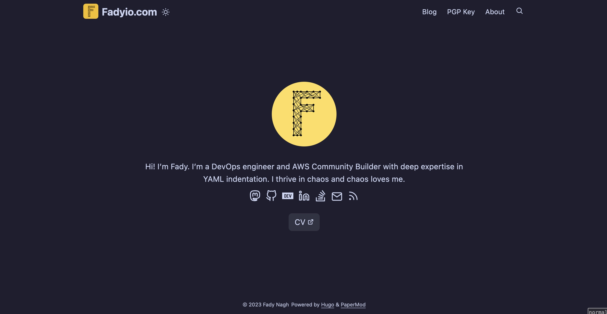
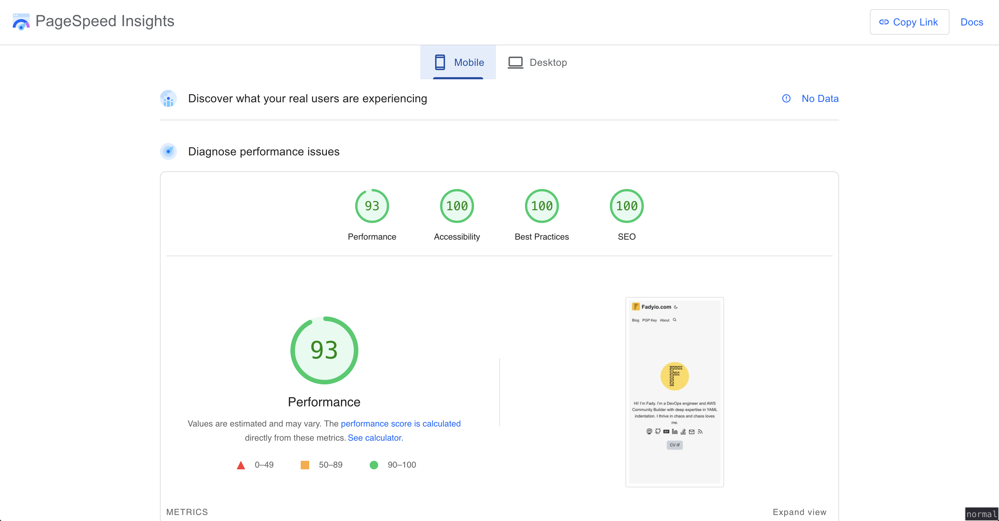

<div align="center">
  
</div>
<div align="center">


</div>

<div align="center">

# My Personal Website Hosted on AWS amplify

</div>




#### Below are some neat features:



- Powered by Hugo
- Uses a heavily modded version of [PaperMod](https://github.com/adityatelange/hugo-PaperMod)
- Uses custom shortcodes for pretty rendering of link previews
- Custom pages and taxonomy support
- Enhanced SEO optimisations

## Installation

- Install hugo-extended v0.87
- Clone the repo and run `hugo server`

    ```bash
        git clone https://github.com/Fadyio/Fadyio.com &&
        cd Fadyio.com &&
        hugo serve -D
    ```

## License

Copyright 2023 Fady Nagh

Licensed under MIT License : https://opensource.org/licenses/MIT

Thankful to [PaperMod](https://github.com/adityatelange/hugo-PaperMod)
