There's no denying it — Kubernetes has become the de-facto industry standard for container orchestration.

But Setting up and maintaining Kubernetes clusters to run containerized workloads can be a challenge, especially if you are running it on the cloud. You need to take care of networking, setting up the master node, security and continuous updates and patches.

Fortunately, you can use Elastic Kubernetes Service (EKS), EKS is a managed Kubernetes service that makes running Kubernetes on AWS as simple as pushing a button.

In this article, we’ll walk you through how to set up and run a Kubernetes deployment on AWS using EKS.


## Step 0: Before you start
> 0. AWS account.
> 1. [AWS CLI](https://docs.aws.amazon.com/cli/latest/userguide/getting-started-install.html)installed on your computer, while you can use the AWS Console to create a cluster in EKS, the AWS CLI is easier
> 2. [Kubectl](https://kubernetes.io/docs/tasks/tools/) used for communicating with the cluster API server.
> 3. AWS-IAM-Authenticator – to allow IAM authentication with the Kubernetes cluster.


EKS is not included in [AWS Free Tier](https://aws.amazon.com/free/?all-free-tier) For every cluster you create on EKS, you pay $0.10/hour. Additionally, you will also be paying for the resources you consume separately.

## Step 1:Creating an EKS role
Our first step is to set up a new IAM role with EKS permissions.

To do this, follow these steps:

Open the [IAM console](https://console.aws.amazon.com/iam/), Select the Roles section on the left side of the page, then click the Create Role button at the top of the page.
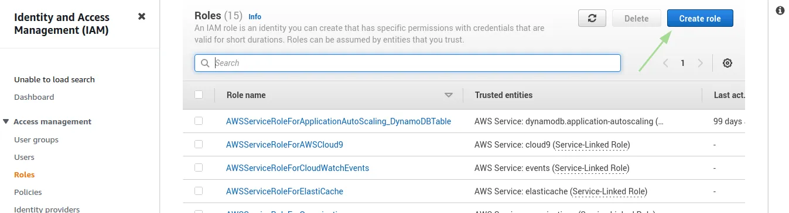
From the list of AWS services, select EKS and then Next: Permissions at the bottom of the page.
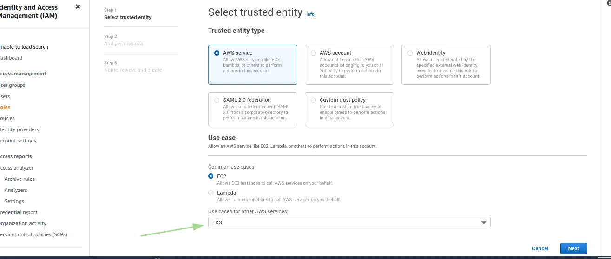
Select policies as in the image, and proceed to the Review page.

Enter a name for the role and hit the Create role button at the bottom of the page to create the IAM role.
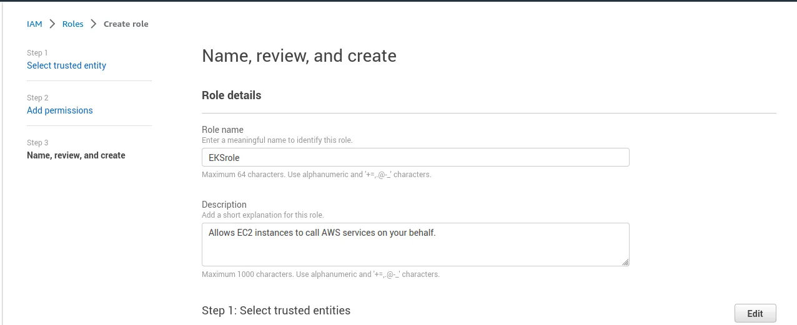
The IAM role is created.


Be sure to record the Role ARN, as you'll need it later when creating your Kubernetes cluster.


Amazon EKS now also offers [service account IAM roles](https://docs.aws.amazon.com/eks/latest/userguide/iam-roles-for-service-accounts.html), eliminating previous iterations’ requirement for extended worker node permissions.


## Step 2: Creating a VPC for EKS
Now, we’re going to create a separate VPC that protects the communication between worker nodes and the AWS Kubernetes API server for our EKS cluster. To do this, we’re going to use a CloudFormation template that contains all the necessary EKS-specific ingredients for setting up the VPC.

Open up [CloudFormation](https://console.aws.amazon.com/cloudformation) and click the Create new stack button.
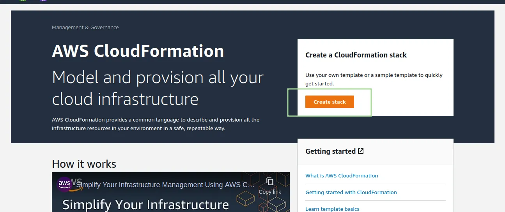
On the Select template page, enter the URL of the CloudFormation YAML in the relevant section:
```
https://amazon-eks.s3-us-west-2.amazonaws.com/cloudformation/2019-01-09/amazon-eks-vpc-sample.yaml
```
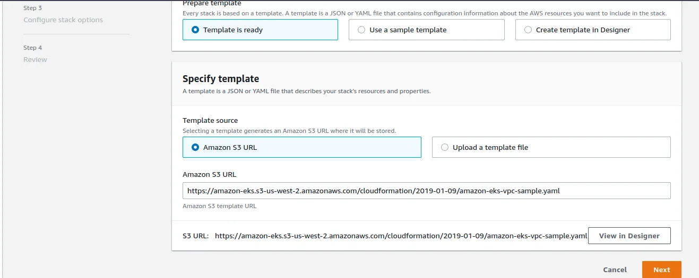
Click Next and choose the name of the stack,leave the default network configurations as is, and click Next.

Leave the default options untouched and then click Next and Next.
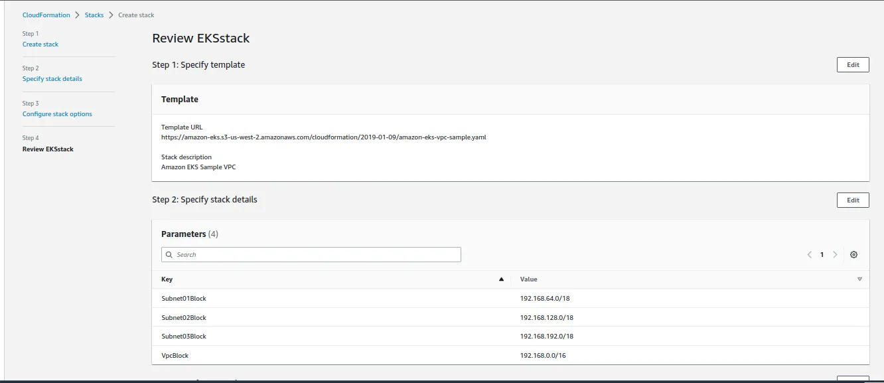
Now The CloudFormation will begin to create the VPC. Once done, be sure to note the various values created Security Groups, Vpc ID and Sub-nets ID. You will need these in subsequent steps. You can see these under the Outputs tab of the CloudFormation stack.
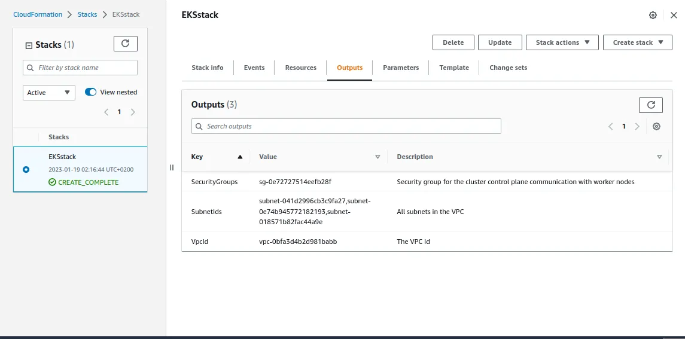

Step 3: Creating the EKS cluster
we will use the AWS CLI to create the Kubernetes cluster. To do this, use the following command:
```
aws eks --region <region> create-cluster --name <clusterName> --role-arn <EKS-role-ARN> --resources-vpc-config subnetIds=<subnet-id-1>,<subnet-id-2>,<subnet-id-3>,securityGroupIds=<security-group-id>
```

Be sure to replace the bracketed parameters as follows:

>- Region — the region in which you wish to deploy the cluster.
>- ClusterName — a name for the EKS cluster you want to create.
>- EKS-role-ARN — the ARN of the IAM role you created in the first step.
>- SubnetIds — SubnetIds values from the AWS CloudFormation output that you generated in the previous step.
>- Security-group-id — the SecurityGroups value from the AWS CloudFormation output that you generated in the previous step.
This is an example of what this command will look like:
```
aws eks --region us-east-1 create-cluster --name MyEKSCluster --role-arn arn:aws:iam::225056333784:role/EKSrole --resources-vpc-config subnetIds=subnet-041d2996cb3c9fa27,subnet-0e74b945772182193,subnet-018571b82fac44a9e,securityGroupIds=sg-0e72727514eefb28f
```

``` yml {linenos=true}
{
"cluster": {
    "name": "MyEKSCluster",
    "arn": "arn:aws:eks:us-east-1:225056333784:cluster/MyEKSCluster",
    "createdAt": "2023-01-19T03:02:39.215000+02:00",
    "version": "1.23",
    "roleArn": "arn:aws:iam::225056333784:role/EKSrole",
    "resourcesVpcConfig": {
        "subnetIds": [
            "subnet-041d2996cb3c9fa27",
            "subnet-0e74b945772182193",
            "subnet-018571b82fac44a9e"
        ],
        "securityGroupIds": [
            "sg-0e72727514eefb28f"
        ],
        "vpcId": "vpc-0bfa3d4b2d981babb",
        "endpointPublicAccess": true,
        "endpointPrivateAccess": false,
        "publicAccessCidrs": [
            "0.0.0.0/0"
        ]
    },
    "kubernetesNetworkConfig": {
        "serviceIpv4Cidr": "10.100.0.0/16",
        "ipFamily": "ipv4"
    },
    "logging": {
        "clusterLogging": [
            {
                "types": [
                    "api",
                    "audit",
                    "authenticator",
                    "controllerManager",
                    "scheduler"
                ],
}
```

Usually it takes about 5 minutes before your cluster is created. You can ping the status of the command using this CLI command:
```
aws eks --region us-east-1 describe-cluster --name MyEKSCluster --query cluster.status
```
The output displayed will be:
```
$ "CREATING"
```
Or you can open the Clusters page.


Once the status changes to “ACTIVE”, we can proceed with updating our kubeconfig file with the information on the new cluster so kubectl can communicate with it.
I will use the AWS CLI update-kubeconfig command to do that.
```
aws eks --region us-east-1 update-kubeconfig --name MyEKSCluster
```
And you should see
```
Added new context arn:aws:eks:us-east-1:225056333784:cluster/MyEKSCluster to /home/f0dy/.kube/config
```
Now you can test the configurations using the kubectl get svc command.
```
kubectl get svc
```
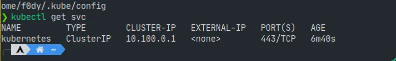
Click the cluster in the EKS Console to review configurations:
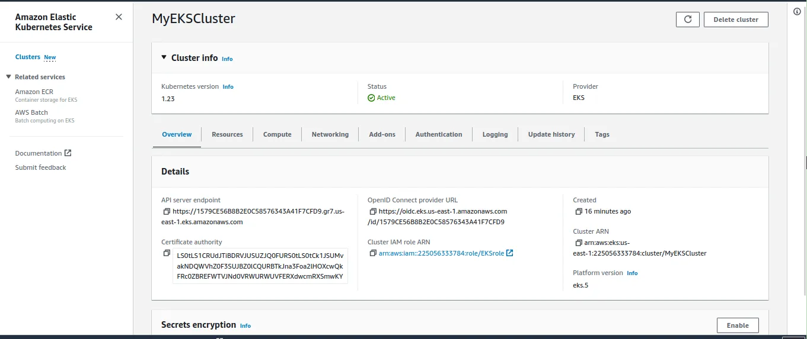
## Step 4: Launching Kubernetes worker nodes
Now that we’ve set up our cluster and VPC networking, we can now launch Kubernetes worker nodes.
We will again use a CloudFormation template.
Again open CloudFormation, click Create Stack, and this time use the following template URL:
```
https://amazon-eks.s3-us-west-2.amazonaws.com/cloudformation/2019-01-09/amazon-eks-nodegroup.yaml
```
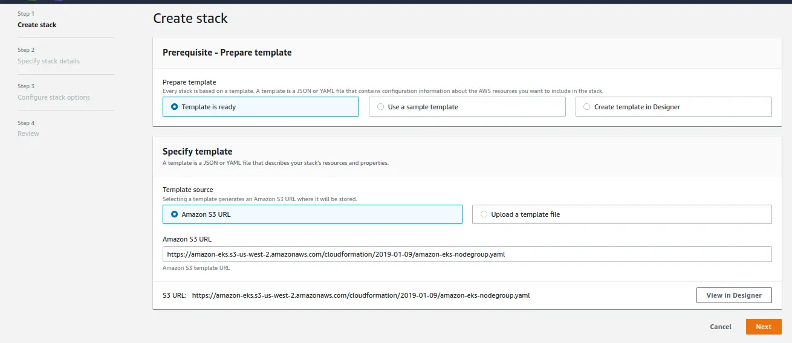
Click next, name your cloudformation stack, and in the eks cluster section enter the following
>- ClusterName – the name of your Kubernetes cluster (e.g. MyEKSCluster)
>- ClusterControlPlaneSecurityGroup – the same security group you used for creating the cluster in previous step.
>- NodeGroupName – a name for your node group.
>- NodeAutoScalingGroupMinSize – leave as-is. The minimum number of nodes that your worker node Auto Scaling group can scale to.
>- NodeAutoScalingGroupDesiredCapacity – leave as-is. The desired number of nodes to scale to when your stack is created.
>- NodeAutoScalingGroupMaxSize – leave as-is. The maximum number of nodes that your worker node Auto Scaling group can scale out to.
>- NodeInstanceType – leave as-is. The instance type used for the worker nodes.
>- NodeImageId – the Amazon EKS worker node AMI ID for the region you’re using. For us-east-1, for example: ami-0b5eea76982371e91
>- KeyName – the name of an Amazon EC2 SSH key pair for connecting with the worker nodes once they launch.
>- BootstrapArguments – leave empty. This field can be used to pass optional arguments to the worker nodes bootstrap script.
>- VpcId – enter the ID of the VPC you created in Step 2 above.
>- Subnets – select the three subnets you created in Step 2 above.

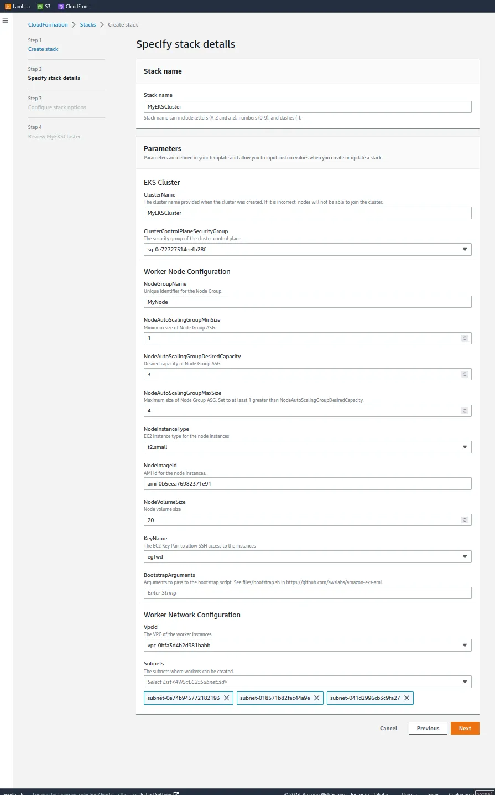
Click Next and check-box at the bottom of the page acknowledging that the stack might create IAM resourcesa
CloudFormation will  create the worker nodes with the VPC settings we entered and three new EC2 instances will be created
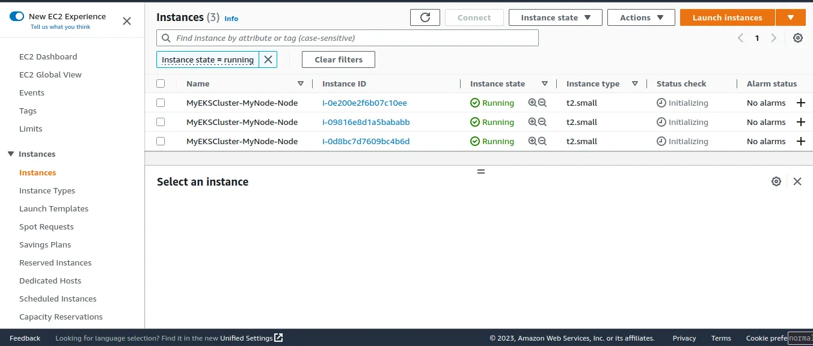
As before, once the stack is created, open Outputs tab:
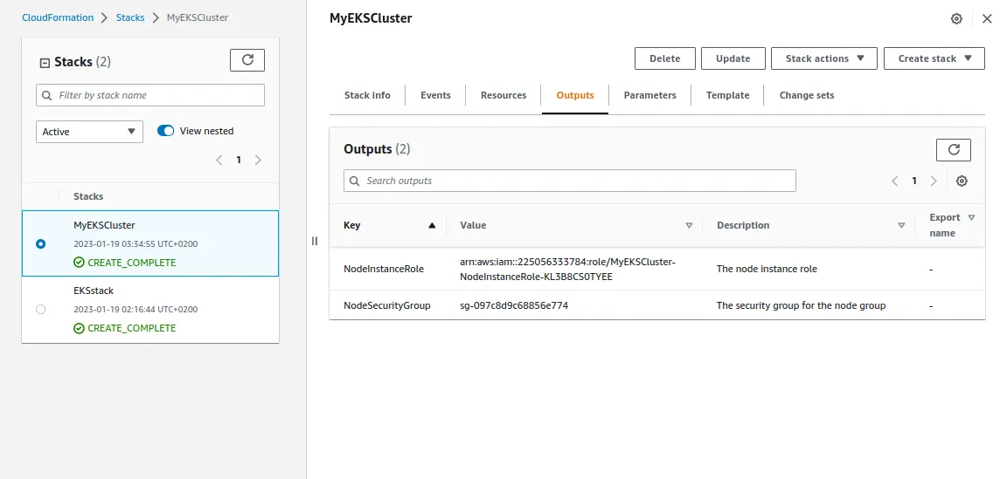
Now download the AWS authenticator configuration map:
```
curl -O https://amazon-eks.s3-us-west-2.amazonaws.com/cloudformation/2019-01-09/aws-auth-cm.yaml
```
Open the file and replace the rolearn with the ARN of the NodeInstanceRole created above:
and then save the file and apply the config:
```
kubectl apply -f aws-auth-cm.yaml
```
You should see
```
configmap/aws-auth created
```
Use kubectl to check on the status of your worker nodes:
```
kubectl get nodes --watch
```
## Step 5: Installing an app on Kubernetes
Congrats! you made it Your Kubernetes cluster is created and set up.

we’re going to deploy a simple Guestbook app.
The following commands create the different Kubernetes building blocks required to run the app.
The Redis master replication controller, the Redis master service, the Redis slave replication controller, the Redis slave service, the Guestbook replication controller and the guestbook service itself:

```
kubectl apply -f https://raw.githubusercontent.com/kubernetes/examples/master/guestbook-go/redis-master-controller.json
kubectl apply -f https://raw.githubusercontent.com/kubernetes/examples/master/guestbook-go/redis-master-service.json
kubectl apply -f https://raw.githubusercontent.com/kubernetes/examples/master/guestbook-go/redis-slave-controller.json
kubectl apply -f https://raw.githubusercontent.com/kubernetes/examples/master/guestbook-go/redis-slave-service.json
kubectl apply -f https://raw.githubusercontent.com/kubernetes/examples/master/guestbook-go/guestbook-controller.json
kubectl apply -f https://raw.githubusercontent.com/kubernetes/examples/master/guestbook-go/guestbook-service.json
```
Use kubectl to see a list of your services:
```
kubectl get svc
```
```
NAME           TYPE           CLUSTER-IP      EXTERNAL-IP                     PORT(S)          AGE
guestbook      LoadBalancer   10.100.8.214    <guestbook’s external IP>       3000:31024/TCP   104s
kubernetes     ClusterIP      10.100.0.1      <none>                          443/TCP          47m
redis-master   ClusterIP      10.100.241.18   <none>                          6379/TCP         2m7s
```
Open your browser and point to the guestbook’s external IP at port 3000 and you should see:
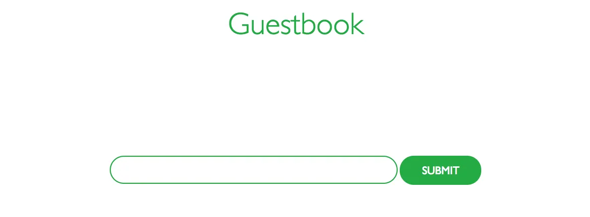
## Summing it up
If you are AWS power users, Amazon EKS is a natural fit. For those of you who are just starting in the cloud, Amazon EKS might seem a bit daunting to begin with.
