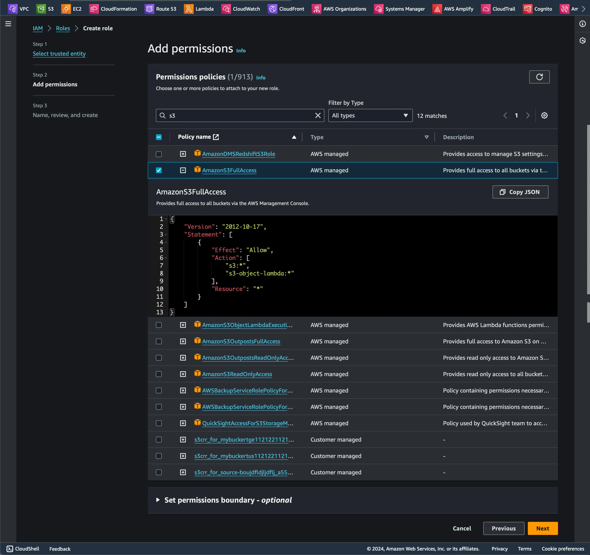
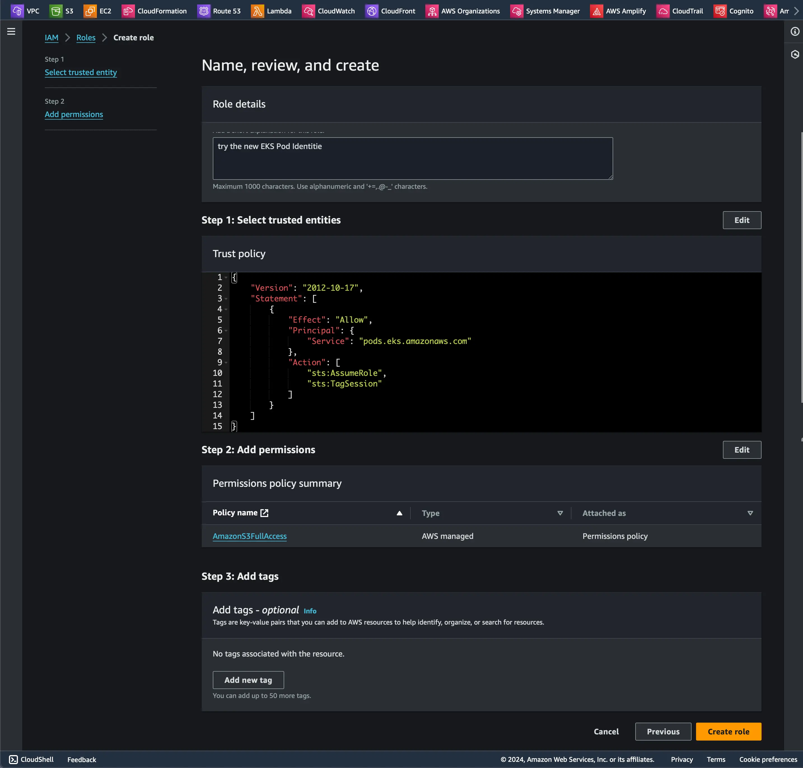
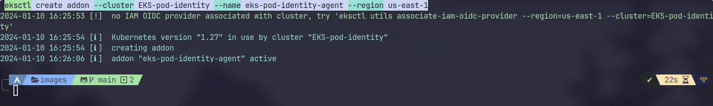
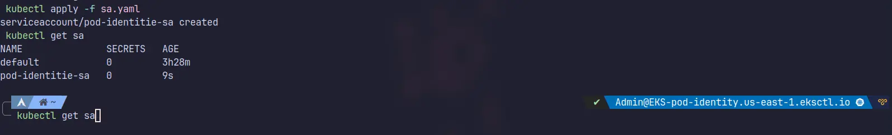
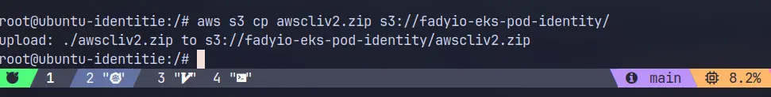

In the latest AWS re:Invent, the EKS team introduced a new feature called Pod Identity. This feature makes it easier to manage IAM credentials in Kubernetes applications.

In the past, applications in a pod could use AWS SDK or aws cli to make API requests to AWS services, leveraging AWS Identity and Access Management (IAM) permissions. With EKS Pod Identities, there's now a simpler way to manage credentials for your EKS applications, similar to how Amazon EC2 instance profiles access credentials to interact with other services. Instead of distributing AWS credentials to the containers, you can associate an IAM role with a Kubernetes service account and configure your pods to use this service account.

In this blog, I will guide you through the process of getting started with EKS Pod Identity. We will configure a simple API running in my Amazon EKS cluster to access Amazon S3 and create files there.

#### Step 0: Before you start
> 1. AWS account.
> 2. [EKSctl](https://eksctl.io/) used for communicating with the cluster API server.
> 3. AWS-IAM-Authenticator – with necessary permissions to call the EKS API.
> 4. EKS Cluster (v1.27) - If you don't know how to set up an EKS cluster, [click here](https://docs.aws.amazon.com/eks/latest/userguide/getting-started.html).


> [!danger] Be careful 
> As of writing this article EKS is not included in [AWS Free Tier](https://aws.amazon.com/free/?all-free-tier) For every cluster you create on EKS, you pay $0.10/hour.

#### Step 1: Install EKS pod Identity Agent addon and create an IAM role

Our first step is to set up a new IAM role with required permissions to access my S3 bucket.

```json title="IAM.Json" caption="The trust policy" showLineNumbers{1} 
{
    "Version": "2012-10-17",
    "Statement": [
        {
            "Effect": "Allow",
            "Principal": {
                "Service": "pods.eks.amazonaws.com"
            },
            "Action": [
                "sts:AssumeRole",
                "sts:TagSession"
            ]
        }
    ]
}
```




Then you need to install the eks pod identity agent addon, You can do it via the console or eksctl. I will choose eksctl because it's easier and quicker, Don't forget to replace the name of the cluster and the region that you chose.

```bash title="Install the EKS Pod Identity Agent" 
eksctl create addon --cluster EKS-pod-identity --name eks-pod-identity-agent --region us-east-1
```




Now, navigate to the 'Access' tab in the EKS cluster, click on 'Pod Identity Associations' to map our IAM role to Kubernetes pods


#### Step 2: Create an S3 bucket and a service account to test the new Pod Identitie

Create an S3 bucket for testing, again, you can do it via the console or AWS CLI

```bash title="Create an S3 bucket" 
aws s3api create-bucket --bucket fadyio-eks-pod-identity --region us-east-1
```


Then, create a service account with the IAM role that we previously created

```yml title="ServiceAccount.yml" caption="The service account config" showLineNumbers{1} 
apiVersion: v1
kind: ServiceAccount
metadata:
  annotations:
    eks.amazonaws.com/role-arn: arn:aws:iam::<YOUR-ACCOUNTID>:role/EKS-Pod-Identitie
  name: pod-identitie-sa
  namespace: default
```



#### Step 3: Create a Pod to test access to the S3 bucket

```yml title="Pod.yml" caption="The Pod manifest" showLineNumbers{1} 
apiVersion: v1
kind: Pod
metadata:
  name: ubuntu-identitie
spec:
  serviceAccountName: pod-identitie-sa
  containers:
  - command:
    - sleep
    - "3600"
    image: ubuntu
    name: ubuntu-identitie
```

```bash title="Apply the Pod manifest"
kubectl apply -f FILENAME.yam
```

we will go into the pod to install the AWS CLI and try to list S3 buckets

```bash title="Get into the pod"
kubectl exec -it ubuntu-identitie -- /bin/bash
```

from the [AWS CLI Installation Guide](https://docs.aws.amazon.com/cli/latest/userguide/getting-started-install.html)


```bash  title="Install the AWS CLI"
apt update && apt install unzip curl -y
curl "https://awscli.amazonaws.com/awscli-exe-linux-x86_64.zip" -o "awscliv2.zip"
unzip awscliv2.zip
./aws/install
```
Let's try to copy the AWS CLI zip file to the S3 bucket

```bash title="Copy the AWS CLI zip file to the S3 bucket"
aws s3 cp awscliv2.zip s3://fadyio-eks-pod-identity/
```




#### Summing it up
EKS Pod Identity is a game-changer that simplifies IAM permissions for applications that runs on EKS, A hassle-free configuration experience that makes it easy to define the necessary IAM permissions for your applications in Amazon EKS, Plus, it brings a bunch of security perks like Least Privilege, Credential Isolation, Auditability, Reusability, and better Scalability into the mix.
